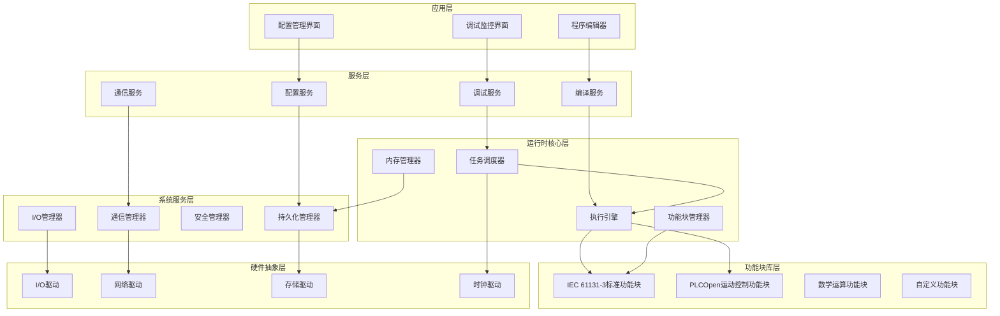

# PLC核心运行时系统设计文档

## 概述

本文档描述了Uranus PLC核心运行时系统的总体设计方案。该系统基于IEC 61131-3标准，采用模块化架构设计，提供高性能、实时、可扩展的PLC程序执行环境。

## 总体架构

### 系统架构图



### 架构设计原则

1. **分层架构**: 清晰的职责分离，降低耦合度
2. **模块化设计**: 每个组件独立开发和测试
3. **实时性优先**: 确保1ms级别的确定性响应
4. **标准遵循**: 严格遵循IEC 61131-3和PLCOpen标准
5. **可扩展性**: 支持插件机制和功能扩展

## 核心组件概述

### 1. 实时任务调度器
**设计理念**: 提供确定性的1ms级别任务调度能力
- 采用固定优先级抢占式调度策略
- 支持循环任务、中断任务、自由运行任务
- 基于时间轮算法的高效任务管理
- 跨平台实时性能优化
- 详细设计参见: [实时调度器设计](./design-realtime-scheduler.md)

### 2. 运动控制算法引擎
**设计理念**: 提供高精度、平滑的运动控制能力
- 梯形和S曲线运动规划算法
- 多轴协调插补算法
- PID和高级控制算法
- 实时轨迹计算和优化
- 详细设计参见: [运动控制算法设计](./design-motion-algorithms.md)

### 3. IEC 61131-3功能块系统
**设计理念**: 严格遵循工业标准，提供完整的功能块支持
- 标准功能块库 (定时器、计数器、逻辑运算)
- PLCOpen运动控制功能块
- 用户自定义功能块支持
- 功能块依赖管理和执行优化

### 4. ST语言编译系统
**设计理念**: 提供完整的结构化文本语言支持
- 基于BNF语法的标准化解析
- 多阶段编译流程 (词法→语法→语义→代码生成)
- 类型安全和错误检测
- 代码优化和性能提升
- 详细设计参见: [ST语言编译器设计](./design-st-compiler.md)

### 5. 工业I/O系统
**设计理念**: 提供标准化、可扩展的I/O接口
- 统一的I/O驱动架构
- 支持数字I/O、模拟I/O、特殊功能I/O
- 实时I/O扫描和故障检测
- 热插拔和动态配置支持
- 详细设计参见: [I/O系统设计](./design-io-system.md)

### 6. 工业通信系统
**设计理念**: 支持多种工业通信协议的统一接口
- Modbus、OPC UA、EtherNet/IP协议支持
- 客户端和服务器双重角色
- 数据映射和实时同步
- 通信安全和诊断
- 详细设计参见: [通信系统设计](./design-communication.md)

### 7. 安全管理系统
**设计理念**: 提供工业级安全保护能力
- 多层次认证和授权机制
- 数据加密和完整性保护
- 审计日志和合规性支持
- 入侵检测和威胁响应
- 详细设计参见: [安全系统设计](./design-security.md)

## 技术选型

### 编程语言和框架
- **核心运行时**: C++17/20 (性能和实时性要求)
- **编程环境**: Microsoft .NET MAUI (跨平台编辑器和开发工具)
- **脚本支持**: Python 3.8+ (自动化脚本和扩展功能)
- **编译器**: ANTLR4 (ST语言解析)
- **网络通信**: Boost.Asio (异步I/O)
- **序列化**: Protocol Buffers (数据交换)

### 架构组成
- **PLC运行时核心**: C++实现的高性能实时引擎
- **开发环境**: .NET MAUI跨平台编辑器和调试工具
- **脚本引擎**: Python集成，支持自动化和扩展脚本
- **API接口**: C++ Native API + .NET互操作 + Python绑定

### 平台支持
- **Windows**: Windows 10/11, 支持实时优化
- **Linux**: 标准Linux + RT-PREEMPT实时内核
- **macOS**: 通过.NET MAUI支持开发环境
- **实时系统**: QNX, VxWorks (可选)

### 核心库依赖
- **数学计算**: Eigen (矩阵运算)
- **JSON处理**: nlohmann/json
- **日志系统**: spdlog
- **C++测试**: Google Test + Google Mock
- **.NET测试**: xUnit + Moq + FluentAssertions
- **Python测试**: pytest + unittest.mock
- **Python集成**: pybind11 (Python C++绑定)
- **.NET互操作**: C++/CLI或P/Invoke

### 开发工具技术栈
- **UI框架**: .NET MAUI (Windows, macOS, Linux)
- **图形渲染**: SkiaSharp (2D图形)
- **代码编辑**: Monaco Editor集成或自定义编辑器
- **项目管理**: .NET配置系统
- **调试接口**: gRPC或REST API与C++运行时通信

## 性能指标

### 实时性能
- **任务调度精度**: ±10μs (RT-PREEMPT Linux)
- **I/O响应时间**: <100μs
- **功能块执行**: <1ms (典型PLC程序)
- **内存分配**: <1μs (预分配池)

### 系统容量
- **最大任务数**: 64个并发任务
- **最大I/O点数**: 4096点 (数字) + 1024点 (模拟)
- **最大功能块数**: 10000个实例
- **内存使用**: <512MB (典型配置)

## 安全和可靠性

### 错误处理
- 分级错误处理机制
- 故障隔离和自动恢复
- 安全状态管理
- 详细设计参见: [错误处理设计](./design-error-handling.md)

### 数据安全
- 用户认证和权限管理
- 数据加密和完整性校验
- 审计日志和操作追踪
- 详细设计参见: [安全系统设计](./design-security.md)

## 开发方法论

### 测试驱动开发 (TDD)
本项目采用TDD开发方法论，确保代码质量和可维护性：

#### TDD开发流程
1. **红色阶段**: 编写失败的测试用例
2. **绿色阶段**: 编写最小可行代码使测试通过
3. **重构阶段**: 优化代码结构，保持测试通过

#### 多语言TDD策略
- **C++核心**: 使用Google Test进行单元测试和集成测试
- **.NET MAUI**: 使用xUnit进行UI和业务逻辑测试
- **Python脚本**: 使用pytest进行脚本功能测试

#### 测试覆盖率要求
- **核心运行时**: >90%代码覆盖率
- **关键算法**: >95%代码覆盖率
- **API接口**: 100%接口覆盖率

### 持续集成/持续部署 (CI/CD)
- **自动化测试**: 每次提交自动运行全套测试
- **多平台构建**: Windows、Linux、macOS自动构建
- **性能回归测试**: 自动检测性能退化
- **代码质量检查**: 静态分析和代码规范检查

## 开发和调试支持

### 调试功能
- 断点和单步调试
- 变量监控和强制
- 执行轨迹记录
- 性能分析工具
- 详细设计参见: [调试系统设计](./design-debugging.md)

### 开发工具
- ST语言编译器
- 项目管理系统
- 在线编程支持
- 自动化测试工具
- 详细设计参见: [开发工具设计](./design-development-tools.md)

## 部署和配置

### 系统配置
```json
{
    "system": {
        "name": "Uranus PLC Runtime",
        "version": "1.0.0",
        "maxTasks": 64,
        "maxMemoryMB": 512,
        "logLevel": "INFO"
    },
    "scheduler": {
        "defaultCycleTime": 1,
        "maxJitter": 0.1,
        "priorityLevels": 8
    },
    "io": {
        "scanRate": 100,
        "drivers": ["GPIO", "Modbus", "EtherCAT"]
    }
}
```

### 部署架构
- 单机部署: 开发和小型应用
- 分布式部署: 大型工业系统
- 容器化部署: 云端和边缘计算

## 扩展性设计

### 多语言集成架构

#### C++核心运行时
- 高性能实时任务调度
- 内存管理和I/O处理
- 工业通信协议实现
- 安全和加密功能

#### .NET MAUI开发环境
- 跨平台程序编辑器
- 项目管理和配置
- 实时调试和监控界面
- 图形化配置工具

#### Python脚本支持
- 自动化测试脚本
- 数据分析和报告生成
- 自定义功能块开发
- 系统集成和部署脚本

### 插件架构
- **功能块插件**: C++或Python实现
- **I/O驱动插件**: C++实现，Python配置
- **通信协议插件**: C++核心，Python脚本配置
- **用户界面插件**: .NET MAUI扩展

### API接口
- **C++ Native API**: 核心运行时的原生接口
- **.NET互操作API**: 通过C++/CLI或P/Invoke为.NET MAUI提供接口
- **Python API**: 通过pybind11提供Python脚本接口
- **REST API**: Web接口和远程管理
- **gRPC API**: 高性能的开发工具通信接口
- **OPC UA接口**: 工业标准通信接口

## 术语表与规范

### 核心术语定义

- **Jerk (加加速度)**: 加速度对时间的变化率，单位为 mm/s³ 或 units/s³
- **Feedrate (进给速度)**: 刀具沿编程路径的移动速度，单位为 mm/min
- **Look-ahead (前瞻)**: 提前分析后续路径段以优化运动轨迹的算法
- **Blending (路径融合)**: 在路径段连接处进行平滑过渡的技术
- **Process Image (过程映像)**: I/O数据在内存中的镜像，提供一致的数据访问
- **Interpolation (插补)**: 在两点间生成中间点的算法，用于平滑运动控制

### 单位规范

- **位置**: mm (毫米)
- **速度**: mm/s (毫米/秒) 或 mm/min (毫米/分钟)
- **加速度**: mm/s² (毫米/秒²)
- **加加速度**: mm/s³ (毫米/秒³)
- **角度**: rad (弧度) 或 degree (度)
- **时间**: s (秒), ms (毫秒), μs (微秒), ns (纳秒)

### 坐标系规范

- **机床坐标系 (MCS)**: 右手坐标系，X轴向右，Y轴向前，Z轴向上
- **工件坐标系 (WCS)**: 相对于工件的坐标系，可通过G54-G59设置偏移
- **旋转轴**: A轴绕X轴旋转，B轴绕Y轴旋转，C轴绕Z轴旋转，正方向遵循右手定则

## 最小可行产品 (MVP) 定义

### MVP-1: 核心运行时 (第一阶段)

**目标**: 建立基础的PLC运行时框架，验证核心架构

**包含功能**:
- **任务调度器**: 基于优先级的抢占式调度，支持1ms周期任务
- **内存管理**: 基础内存池分配器，支持固定大小块分配
- **基础功能块**: TON, TOF, CTU, CTD, R_TRIG, F_TRIG
- **简单I/O**: 数字输入输出，支持%IX, %QX直接变量
- **C++ API**: 核心运行时的原生接口

**验收标准**: 能够运行包含基础定时器和计数器的简单PLC程序

### MVP-2: 运动控制基础 (第二阶段)

**目标**: 实现基础的单轴运动控制功能

**包含功能**:
- **单轴运动**: MC_Power, MC_MoveAbsolute, MC_MoveRelative, MC_Stop
- **梯形速度规划**: 基础的加减速控制
- **位置控制**: 简单的位置环PID控制
- **运动状态**: 基础的运动状态反馈

**验收标准**: 能够控制单个伺服轴进行点到点运动

### MVP-3: 编程环境 (第三阶段)

**目标**: 提供基础的编程和调试环境

**包含功能**:
- **.NET MAUI编辑器**: 基础的ST语言编辑器
- **ST编译器子集**: 支持变量声明、赋值、IF/CASE、基础运算
- **在线调试**: 变量监控和强制功能
- **项目管理**: 基础的项目文件管理

**验收标准**: 能够编写、编译和调试简单的ST程序

## 相关文档

本设计文档包含以下子文档：

1. [实时调度器设计](./design-realtime-scheduler.md) - 1ms高精度调度算法
2. [运动控制算法设计](./design-motion-algorithms.md) - 轨迹规划和插补算法
3. [内存管理设计](./design-memory-manager.md) - 实时内存管理策略
4. [功能块引擎设计](./design-function-block-engine.md) - IEC 61131-3功能块实现
5. [ST语言编译器设计](./design-st-compiler.md) - 结构化文本语言支持
6. [I/O系统设计](./design-io-system.md) - 工业I/O接口设计
7. [通信系统设计](./design-communication.md) - 工业通信协议
8. [安全系统设计](./design-security.md) - 安全和权限管理
9. [调试系统设计](./design-debugging.md) - 调试和监控功能
10. [错误处理设计](./design-error-handling.md) - 故障处理和恢复

## 开发计划

详细的开发计划和里程碑请参考项目根目录的 `plan.md` 和 `MILESTONES.md` 文件。

---

*本文档版本: 1.0*  
*最后更新: 2024年*  
*下次审查: 设计评审完成后*