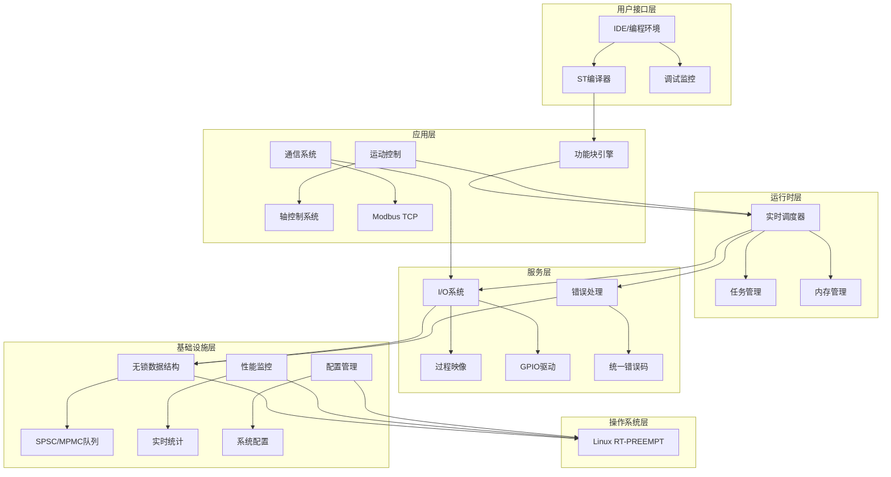

# PLCOpen 项目 AI 上下文

**初始化时间**: 2025-09-06T12:25:40+08:00  
**项目总览**: 基于IEC 61131-3标准的工业级PLC运行时系统  
**当前分支**: feature/mvp1  
**项目状态**: 💚 活跃开发中 (MVP-1阶段)

## 🏗️ 项目架构总览



## 🎯 核心设计原则

- **实时性优先**: 微秒级调度精度，调度抖动 < 50μs
- **确定性内存**: 固定池 + 预算管理，避免动态分配
- **无锁架构**: 关键路径采用无锁数据结构
- **标准合规**: 严格遵循IEC 61131-3标准
- **模块化设计**: 松耦合的模块化架构

## 📊 性能指标

| 指标 | 目标值 | 当前状态 |
|------|--------|----------|
| 调度抖动 | < 50μs | 🟡 开发中 |
| I/O扫描周期 | < 100μs | 🟡 开发中 |
| 内存分配时间 | < 10μs | 🟡 开发中 |
| 任务切换时间 | < 5μs | 🟡 开发中 |
| 最大轴数 | 32轴 | 🟢 架构支持 |
| 最大I/O点数 | 4096点 | 🟢 架构支持 |

## 📁 模块索引

### 核心运行时模块
- **[调度器 (`src/scheduler/`)](/root/Repos/plcopen/src/scheduler/CLAUDE.md)** - 实时任务调度，支持256级优先级
- **[I/O系统 (`src/io/`)](/root/Repos/plcopen/src/io/CLAUDE.md)** - 双缓冲过程映像，GPIO驱动
- **[内存管理 (`src/memory/`)](/root/Repos/plcopen/src/memory/CLAUDE.md)** - 固定池分配器，泄漏检测
- **[功能块引擎 (`src/fb/`)](/root/Repos/plcopen/src/fb/CLAUDE.md)** - IEC 61131-3标准功能块

### 编程语言支持
- **[ST编译器 (`src/st_compiler/`)](/root/Repos/plcopen/src/st_compiler/CLAUDE.md)** - 结构化文本语言编译器
- **[语法分析 (`include/st_compiler/`)](/root/Repos/plcopen/include/st_compiler/CLAUDE.md)** - AST、符号表、词法分析

### 运动控制
- **[运动控制 (`src/motion/`)](/root/Repos/plcopen/src/motion/CLAUDE.md)** - 多轴运动控制，S曲线规划
- **[轴控制 (`src/motion/axis/`)](/root/Repos/plcopen/src/motion/axis/CLAUDE.md)** - 单轴控制，回零，插补

### 基础设施
- **[无锁结构 (`src/lockfree/`)](/root/Repos/plcopen/src/lockfree/CLAUDE.md)** - SPSC/MPMC队列，原子工具
- **[错误处理 (`src/error/`)](/root/Repos/plcopen/src/error/CLAUDE.md)** - 统一错误码，异常处理
- **[配置管理 (`src/config/`)](/root/Repos/plcopen/src/config/CLAUDE.md)** - 系统配置管理

### 测试与验证
- **[CI测试 (`tests/ci/`)](/root/Repos/plcopen/tests/ci/CLAUDE.md)** - 持续集成基准测试
- **[性能测试 (`tests/performance/`)](/root/Repos/plcopen/tests/performance/CLAUDE.md)** - 实时性能基准套件

## 🚀 开发阶段

### 当前阶段: MVP-1 (核心运行时系统)
**时间范围**: 2025年1-3月  
**主要目标**: 建立PLC系统的核心运行时基础架构

#### 已完成 ✅
- P0阶段基础设施 (无锁数据结构、错误处理、配置管理)
- 系统架构设计和技术规范
- 基础项目结构和构建系统

#### 进行中 🟡
- 实时调度器核心实现
- I/O系统和过程映像管理
- ST编译器基础实现
- 标准功能块库开发

#### 计划中 ⏳
- 通信系统 (Modbus TCP)
- 运动控制集成
- 性能调优和测试

### 后续阶段预览
- **阶段2**: 编程语言支持 (ST, IL语言完整实现)
- **阶段3**: 图形化编程 (LD, FBD, SFC编辑器)
- **阶段4**: 集成开发环境 (跨平台IDE)
- **阶段5**: 通信和网络 (工业协议支持)
- **阶段6**: 高级功能 (冗余、安全、云集成)

## 🔧 技术栈

- **语言**: C++17 (核心运行时), TypeScript/Electron (IDE)
- **构建系统**: CMake 3.15+
- **实时内核**: Linux RT-PREEMPT
- **编译器**: GCC 9+ / Clang 10+ / MSVC 2019+
- **测试框架**: 自定义测试框架
- **文档**: Doxygen, Markdown

## 📋 快速开始

### 构建系统
```bash
# Linux环境
mkdir build && cd build
cmake -DCMAKE_BUILD_TYPE=Release ..
make -j$(nproc)

# Windows环境
mkdir build && cd build
cmake -G "Visual Studio 16 2019" ..
msbuild PLCRuntimeCore.sln /p:Configuration=Release
```

### 运行演示
```bash
# 基础演示
./build/bin/mvp1_integration_test

# MVP-1功能展示
./build/bin/mvp1_showcase

# 性能基准测试
./build/bin/ci-benchmark-gates
```

## 🔍 重要文件

### 核心接口
- **[plc_runtime_core.h](/root/Repos/plcopen/include/plc_runtime_core.h)** - 主要系统接口
- **[TaskControlBlock.h](/root/Repos/plcopen/src/scheduler/TaskControlBlock.h)** - 任务控制块定义
- **[FunctionBlock.h](/root/Repos/plcopen/include/function_block/FunctionBlock.h)** - 功能块基类

### 配置文件
- **[CMakeLists.txt](/root/Repos/plcopen/CMakeLists.txt)** - 主构建配置
- **[plan.md](/root/Repos/plcopen/plan.md)** - 项目开发计划
- **[MVP-1_TECHNICAL_ARCHITECTURE.md](/root/Repos/plcopen/MVP-1_TECHNICAL_ARCHITECTURE.md)** - MVP-1技术架构

### 文档
- **[README.md](/root/Repos/plcopen/README.md)** - 项目说明文档
- **[BUILD_README.md](/root/Repos/plcopen/BUILD_README.md)** - 构建说明
- **[doc/](/root/Repos/plcopen/doc/)** - 设计文档和参考资料

## 🎨 代码规范

- **命名**: snake_case (变量、函数), PascalCase (类型)
- **格式**: 使用clang-format，4空格缩进
- **注释**: Doxygen格式，中英文混合
- **错误处理**: 统一错误码 + 异常机制
- **内存**: RAII原则，智能指针优先

## 🔐 安全性考虑

- **实时约束**: 严格的时间预算和监控
- **内存安全**: 固定池分配，边界检查
- **错误隔离**: 分层错误处理，优雅降级
- **权限控制**: 实时任务权限管理
- **数据完整性**: 双缓冲机制，原子操作

## 📈 监控与调试

- **实时监控**: 任务执行时间、调度延迟统计
- **内存监控**: 内存使用、泄漏检测
- **性能分析**: 热点分析、瓶颈识别
- **错误追踪**: 错误日志、调用栈追踪

---

*本文档由 init-architect 智能体自动生成和维护，反映项目的最新状态和架构决策。*