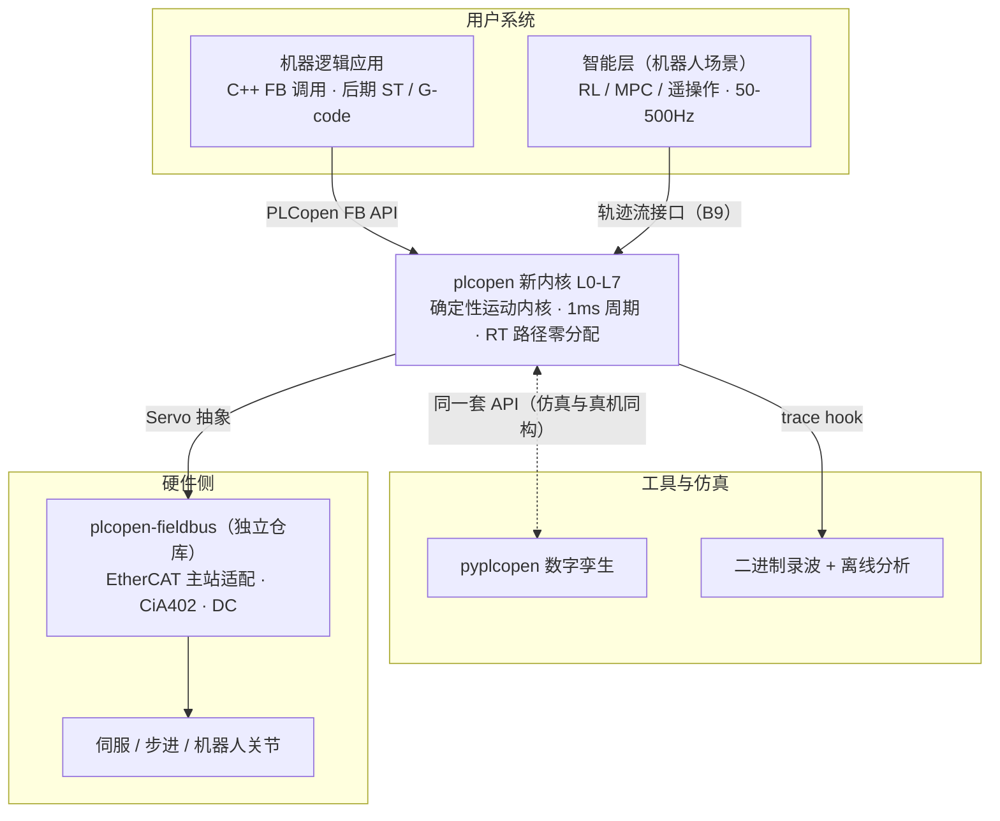
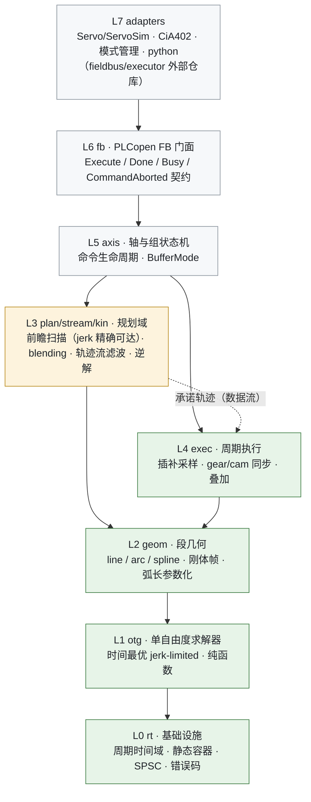
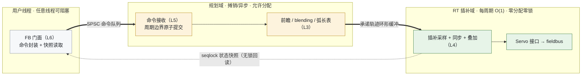
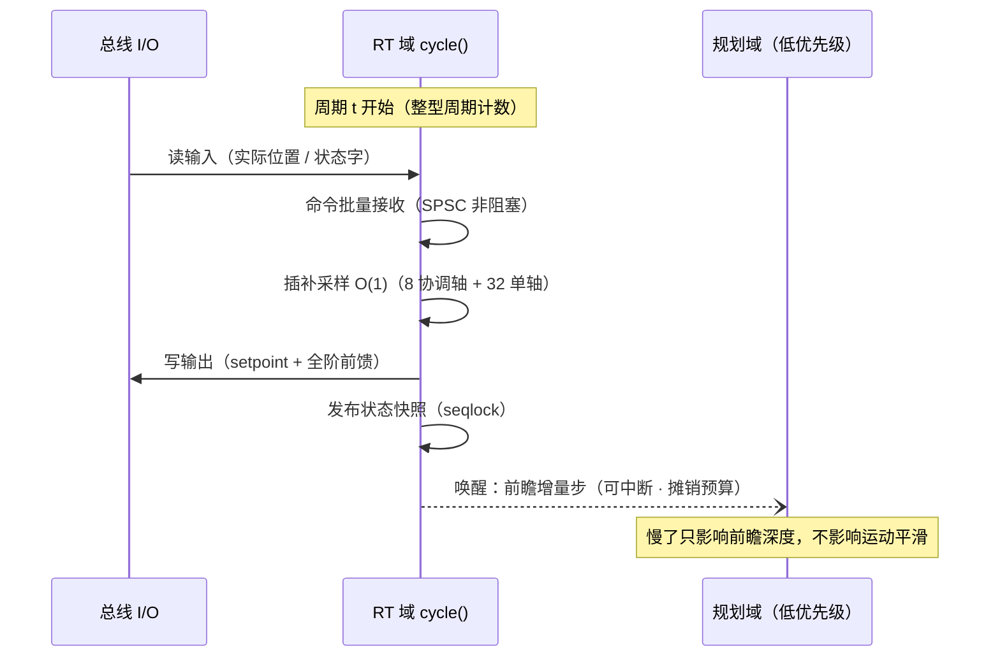

# 新核架构图集（canonical）

本文件是新核架构图的**单一事实源**（Mermaid，GitHub 原生渲染）。`rewrite-plan.md` §2 的 ASCII 草图为提案期快照，两者矛盾时以本文件为准。维护规则见文末。

> 本文件是 `doc/design/core/` 设计文档树的第一份文件。设计文档原则上「随码写」（rewrite-plan §3.6 第二拍），架构图作为 R1 编码前的共同蓝图**先行**，是 M0 的合理例外。

---

## 图 1：系统上下文

plcopen 是「智能层/应用层之下、驱动器之上」的确定性运动内核，以库的形式嵌入用户系统。

要点：核心永不直接触碰 OS 与总线——线程、时钟归用户（或参考 executor），总线适配隔离在独立仓库（GPL 边界，rewrite-plan §2.6/T7）。

---

## 图 2：分层与依赖规则

实线 = 编译期依赖（只向内/向下）；虚线 = 运行期数据流。**L0-L4 不包含任何 PLCopen 语义**，是可独立复用的通用运动内核；`otg/` 可单独发布。

图例：绿 = RT 域（零分配、零锁、O(1)）；琥珀 = 规划域（允许分配、摊销执行）；灰 = 语义与适配层。

---

## 图 3：运行时数据流（单写者管线）

每块状态**恰好一个写入上下文**；跨域仅两种结构：SPSC 命令队列（去程）、seqlock 状态快照（回程）。规划域慢了只缩短前瞻深度，**永不影响 RT 周期**——这是全部「性能 vs 效果」权衡的架构基础（long-term-plan §6.2）。

机器人轨迹流模式（B9）= 规划域的另一个生产者：流缓冲 + OTG 在线滤波替代路径规划，其余管线不变（robot-integration §2.1）。

---

## 图 4：单周期时序

时间一律整型周期计数（禁浮点时间累加，T8）。周期内预算见 long-term-plan §6.1 预算表。

---

## 实现现状（2026-07-07，X 系列收口；本表随批次收口更新，漂移即缺陷）

图 1-4 的蓝图已全部落为实现；层 → 目录 → 边界编号对照：

| 层 | 目录 | 已落地 | KB |
|----|------|--------|-----|
| L0 | `core/rt` | 周期时间域、定长容器、SPSC、错误码 | — |
| L1 | `core/otg` | 时间最优 jerk-limited 求解器（任意初速/非零初始加速度、鼓包域分支修复、估计锚定候选） | KB-026/034 |
| L2 | `core/geom` | 直线/三点圆弧/Bezier、刚体帧（绕 Z + 完整 RPY 原语）、弧长表 | KB-030/036 |
| L3 | `core/plan` `core/stream` `core/kin` | 路径缓冲、前瞻窗口（jerk 精确可达扫描）、blending 决策；轨迹流滤波（B9）；kinematics ABI + 龙门/SCARA/6R + 腕奇异带通过 | KB-031/032/033/035/037/039/041/045 |
| L4 | `core/exec` | 周期采样、gear/cam（C0 + C2 样条重建、在线换表）、cam 运动规律生成器、叠加 | KB-038/046 |
| L5 | `core/axis` | 单轴/组状态机、共享路径、坐标系栈、kinematics 级联、双空间限速、流会话、姿态编程面、笛卡尔管线（直线/圆弧/blending/前瞻窗口，插值空间选入）、回读面、窗口深度可配 | KB-035~037/041~044/047~050 |
| L6 | `core/fb` | Part 1/2 全量 + Part 4 线性/圆弧/blending 门面 + 回读 FB 承接 | 矩阵 45/45 |
| L7 | `core/adapters` | Servo 接口/桥接/ServoSim（ADR-0004）、CiA402、CSP/CSV/CST 骨架 | KB-040 |

**已知开放缺陷**：KB-051 组 aborting 接管速度断崖（修复矩阵
[group-takeover-semantics](../../compliance/group-takeover-semantics.md) 待批，Y7 队列第一位）。

图 3 的 seqlock 快照与图 4 的规划域低优先级唤醒已有参考 executor 软件
形态（X3，`core/demo/rt_executor_demo.cpp`，ServoSim 闭环）；硬件对接
待 B7。库内以显式 `cycle()` 与快照读取承载同一合同。各模块详细
设计随码维护在 `core/*/README.md`（设计文档「随码写」原则）。

## 维护规则

1. 本文件是架构图唯一事实源；架构变更必须同 PR 更新本文件（docs-sync 门禁）。
2. 图用 Mermaid（文本可 diff、GitHub 原生渲染、AI 可维护），不引入二进制绘图工具。
3. 每图配一段「要点」即可，详细论证放对应设计文档/ADR，图内文字保持稀疏。
4. 架构裁决先查 `doc/design/decisions/`，新裁决落 ADR 后再改图。

---

*本文档最后更新：2026-07-05（实现现状对齐：Phase B 纯软件收口）*
*关联：[rewrite-plan.md](../../archive/rewrite-plan.md) §2、[long-term-plan.md](../../planning/long-term-plan.md) §6.2、[robot-integration.md](../../planning/robot-integration.md) §2*
