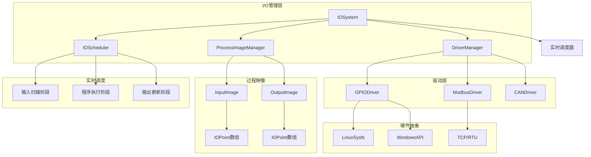

# I/O系统模块 (I/O System)

**路径**: `src/io/` 和 `include/io/`  
**导航**: [🏠 项目根目录](/root/Repos/plcopen/CLAUDE.md) > I/O系统模块  
**模块类型**: 核心服务层模块  
**开发状态**: 🟡 MVP-1 开发中

## 📋 模块概述

I/O系统模块负责PLC运行时系统的输入输出处理，提供双缓冲过程映像、高性能GPIO驱动和实时I/O调度。采用零拷贝技术和缓存友好的数据结构设计，确保I/O扫描周期 < 100μs。

### 核心特性
- **双缓冲映像**: 无锁读写分离，确保数据一致性
- **高速扫描**: I/O扫描周期 < 100μs，支持1000+I/O点
- **批量操作**: 支持批量读写，提升总线效率
- **实时性**: 与调度器紧密集成，确定性I/O时序
- **灵活驱动**: 抽象驱动接口，支持多种硬件平台

## 🏗️ 架构设计



## 📁 文件结构

### 头文件 (include/io/)
- **[ProcessImage.h](/root/Repos/plcopen/include/io/ProcessImage.h)** - 过程映像双缓冲系统
- **[GPIODriver.h](/root/Repos/plcopen/include/io/GPIODriver.h)** - GPIO驱动接口和实现
- **[IOSystem.h](/root/Repos/plcopen/include/io/IOSystem.h)** - I/O系统主接口

### 实现文件 (src/io/)
- **[GPIODriver.cpp](/root/Repos/plcopen/src/io/GPIODriver.cpp)** - GPIO驱动具体实现
- **[IOSystem.cpp](/root/Repos/plcopen/src/io/IOSystem.cpp)** - I/O系统实现
- **[SchedulerIOInterface.cpp](/root/Repos/plcopen/src/io/SchedulerIOInterface.cpp)** - 调度器接口

## 🔧 核心接口

### 过程映像点定义
```cpp
struct IOPoint {
    uint32_t address;              // I/O地址
    IOType type;                   // I/O类型 (DI/DO/AI/AO)
    IODataType data_type;          // 数据类型
    IOStatus status;               // I/O状态
    
    union {
        bool digital_value;        // 布尔值
        uint8_t byte_value;        // 字节值
        uint16_t word_value;       // 字值
        uint32_t dword_value;      // 双字值
        float real_value;          // 实数值
    } value;
    
    uint64_t timestamp_ns;         // 时间戳
    uint32_t quality;              // 数据质量
};
```

### GPIO配置
```cpp
struct GPIOConfig {
    uint32_t pin_number;           // GPIO引脚号
    GPIODirection direction;       // 输入/输出方向
    GPIOPullMode pull_mode;        // 上拉/下拉模式
    GPIOTriggerMode trigger_mode;  // 触发模式
    bool active_low;               // 低电平有效
    uint32_t debounce_ms;          // 消抖时间
};
```

### 过程映像管理器
```cpp
class ProcessImageManager {
public:
    struct Config {
        bool auto_swap = true;           // 自动交换缓冲区
        uint64_t swap_interval_ns = 1000000; // 交换间隔(1ms)
        size_t max_io_points = 2048;     // 最大I/O点数
        bool enable_statistics = true;   // 启用统计
    };
    
    // 生命周期管理
    bool initialize(const Config& config);
    void shutdown();
    
    // 缓冲区管理
    ProcessImage* get_read_buffer();
    ProcessImage* get_write_buffer();
    bool swap_buffers();
    
    // I/O点操作
    bool set_input_point(uint32_t address, const IOPoint& point);
    bool get_output_point(uint32_t address, IOPoint& point);
    bool update_input_batch(const std::vector<IOPoint>& points);
    bool read_output_batch(std::vector<IOPoint>& points);
    
    // 统计信息
    IOStatistics get_statistics() const;
};
```

### GPIO驱动接口
```cpp
class GPIODriver {
public:
    // 基础操作
    virtual bool configure_pin(const GPIOConfig& config) = 0;
    virtual bool read_pin(uint32_t pin, bool& value) = 0;
    virtual bool write_pin(uint32_t pin, bool value) = 0;
    
    // 批量操作
    virtual bool read_batch(const std::vector<uint32_t>& pins, 
                           std::vector<bool>& values) = 0;
    virtual bool write_batch(const std::vector<uint32_t>& pins, 
                            const std::vector<bool>& values) = 0;
    
    // 状态查询
    virtual GPIOStatus get_pin_status(uint32_t pin) const = 0;
    virtual bool is_pin_configured(uint32_t pin) const = 0;
    
    // 统计信息
    virtual DriverStatistics get_statistics() const = 0;
};
```

## 📊 性能特征

### 时间指标
| 指标 | 目标值 | 实际值 | 测试条件 |
|------|--------|--------|----------|
| I/O扫描周期 | < 100μs | 🟡 测试中 | 1000个I/O点 |
| 输入更新延迟 | < 50μs | 🟡 测试中 | 数字I/O |
| 输出响应时间 | < 30μs | 🟡 测试中 | 数字I/O |
| 缓冲区交换 | < 10μs | 🟡 测试中 | 双缓冲模式 |

### 容量指标
| 项目 | 支持数量 | 内存占用 |
|------|----------|----------|
| 数字输入点 | 4096 | 256KB |
| 数字输出点 | 4096 | 256KB |
| 模拟输入点 | 1024 | 64KB |
| 模拟输出点 | 1024 | 64KB |

## 🔍 关键算法

### 双缓冲交换
```cpp
bool ProcessImageManager::swap_buffers() {
    // 原子性检查交换条件
    if (!swap_pending_.load(std::memory_order_acquire)) {
        return false;
    }
    
    // 执行缓冲区交换
    int current = active_buffer_.load();
    int next = 1 - current;
    
    // 更新版本号
    buffers_[next].input_version_.store(
        buffers_[current].input_version_.load() + 1);
    
    // 原子性切换活跃缓冲区
    active_buffer_.store(next, std::memory_order_release);
    swap_pending_.store(false, std::memory_order_release);
    
    update_swap_statistics();
    return true;
}
```

### 批量GPIO读取
```cpp
bool LinuxSysfsGPIO::read_batch(const std::vector<uint32_t>& pins,
                                std::vector<bool>& values) {
    values.resize(pins.size());
    
    // 使用epoll进行批量I/O
    struct epoll_event events[MAX_BATCH_SIZE];
    int ready = epoll_wait(epoll_fd_, events, pins.size(), 0);
    
    for (int i = 0; i < ready; ++i) {
        uint32_t pin = events[i].data.u32;
        auto it = pin_fds_.find(pin);
        if (it != pin_fds_.end()) {
            char value;
            pread(it->second, &value, 1, 0);
            values[i] = (value == '1');
        }
    }
    
    return ready > 0;
}
```

### I/O调度集成
```cpp
void IOScheduler::execute_io_cycle() {
    auto start_time = high_resolution_clock::now();
    
    // 阶段1: 输入扫描
    scan_inputs();
    
    auto input_end = high_resolution_clock::now();
    auto input_duration = duration_cast<nanoseconds>(input_end - start_time);
    
    if (input_duration > timing_config_.input_scan_budget_ns) {
        handle_budget_overrun(IOPhase::INPUT_SCAN, input_duration);
    }
    
    // 通知调度器进入程序执行阶段
    scheduler_interface_->notify_io_phase_complete(
        IOPhase::INPUT_SCAN, input_duration.count());
    
    // 等待程序执行完成
    scheduler_interface_->wait_program_execution_complete();
    
    // 阶段2: 输出更新
    update_outputs();
    
    auto cycle_end = high_resolution_clock::now();
    update_cycle_statistics(start_time, cycle_end);
}
```

## 🧪 测试覆盖

### 单元测试
- ✅ 过程映像双缓冲机制
- ✅ GPIO配置和读写操作
- ✅ 批量I/O操作
- 🟡 错误处理和恢复
- 🟡 统计数据准确性

### 集成测试
- ✅ 与调度器的集成
- 🟡 实时性能验证
- 🟡 多驱动协同工作
- ⏳ 硬件平台兼容性

### 性能测试
- 🟡 I/O扫描周期基准
- 🟡 批量操作性能
- ⏳ 长期稳定性测试
- ⏳ 负载压力测试

## 🚀 使用示例

### 基本I/O操作
```cpp
#include "io/ProcessImage.h"
#include "io/GPIODriver.h"

// 初始化过程映像管理器
ProcessImageManager::Config config;
config.auto_swap = true;
config.swap_interval_ns = 1000000; // 1ms

auto image_manager = std::make_unique<ProcessImageManager>();
image_manager->initialize(config);

// 配置GPIO驱动
auto gpio_driver = std::make_unique<LinuxSysfsGPIO>();
GPIOConfig gpio_config(18, GPIODirection::INPUT);
gpio_config.pull_mode = GPIOPullMode::UP;
gpio_config.debounce_ms = 10;

gpio_driver->configure_pin(gpio_config);

// 读取输入
bool input_value;
if (gpio_driver->read_pin(18, input_value)) {
    // 更新过程映像
    IOPoint input_point;
    input_point.address = 0;
    input_point.type = IOType::DIGITAL_INPUT;
    input_point.value.digital_value = input_value;
    input_point.timestamp_ns = get_current_time_ns();
    input_point.status = IOStatus::VALID;
    
    image_manager->set_input_point(0, input_point);
}
```

### 批量I/O操作
```cpp
// 批量读取数字输入
std::vector<uint32_t> input_pins = {18, 19, 20, 21};
std::vector<bool> input_values;

if (gpio_driver->read_batch(input_pins, input_values)) {
    // 批量更新过程映像
    std::vector<IOPoint> input_points;
    for (size_t i = 0; i < input_pins.size(); ++i) {
        IOPoint point;
        point.address = i;
        point.type = IOType::DIGITAL_INPUT;
        point.value.digital_value = input_values[i];
        point.timestamp_ns = get_current_time_ns();
        point.status = IOStatus::VALID;
        input_points.push_back(point);
    }
    
    image_manager->update_input_batch(input_points);
}
```

### 实时I/O调度
```cpp
// 创建I/O调度器
IOScheduler::IOTiming timing;
timing.input_scan_budget_ns = 50000;   // 50μs预算
timing.output_update_budget_ns = 30000; // 30μs预算

auto io_scheduler = std::make_unique<IOScheduler>(timing);
io_scheduler->register_driver(std::move(gpio_driver));

// 启动实时I/O循环
io_scheduler->start_realtime_cycle();

// 获取性能统计
auto stats = io_scheduler->get_performance_statistics();
std::cout << "平均I/O扫描时间: " << stats.average_scan_time_ns << "ns\n";
std::cout << "预算超时次数: " << stats.budget_overruns << "\n";
```

## 🔧 配置选项

### 编译时配置
```cpp
// 最大I/O点数
#define MAX_IO_POINTS 4096

// 启用GPIO调试
#define ENABLE_GPIO_DEBUG 1

// 批量操作大小
#define GPIO_BATCH_SIZE 64

// 启用性能统计
#define ENABLE_IO_STATISTICS 1
```

### 运行时配置
```cpp
// 动态调整I/O预算
io_scheduler->set_input_scan_budget_ns(40000);  // 40μs

// 启用/禁用自动缓冲区交换
image_manager->enable_auto_swap(true);

// 设置消抖时间
gpio_driver->set_global_debounce_ms(5);
```

## 🔌 硬件支持

### Linux平台
- **Sysfs GPIO**: 标准Linux GPIO子系统
- **Raspberry Pi**: BCM2835/BCM2836/BCM2837
- **BeagleBone**: AM335x GPIO
- **Intel x86**: 工业PC GPIO卡

### Windows平台
- **WinAPI GPIO**: Windows GPIO API
- **PCI GPIO卡**: 研华、凌华等工业卡
- **USB I/O模块**: Modbus、串口转换

### 通信协议
- **Modbus TCP/RTU**: 工业标准协议
- **CANbus**: 汽车和工业总线
- **Profibus**: 西门子工业协议
- **EtherCAT**: 实时以太网

## 🐛 故障排除

### 常见问题
1. **I/O扫描超时**
   - 检查硬件连接
   - 调整扫描预算时间
   - 验证驱动配置

2. **数据不一致**
   - 检查双缓冲配置
   - 验证原子操作
   - 分析时序问题

3. **GPIO读取失败**
   - 检查权限设置
   - 验证引脚配置
   - 测试硬件连接

### 调试工具
```cpp
// 启用I/O调试日志
io_system->enable_debug_logging(true);

// 实时监控I/O状态
auto monitor = io_system->create_realtime_monitor();
monitor->start();

// 导出I/O统计报告
auto stats = io_system->get_detailed_statistics();
stats.export_to_csv("io_performance.csv");
```

## 🔮 未来计划

### 短期目标 (MVP-1)
- ✅ 双缓冲过程映像实现
- 🟡 GPIO驱动优化
- ⏳ Modbus TCP驱动
- ⏳ 完整性能测试

### 中期目标
- CAN总线驱动支持
- EtherCAT实时以太网
- 分布式I/O支持
- 诊断和维护工具

### 长期目标
- 云端I/O网关
- 边缘计算集成
- AI驱动的预测性维护
- 5G工业物联网

---

*本文档反映I/O系统模块的当前实现状态和技术规范。*