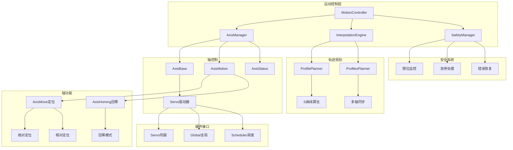

# 运动控制模块 (Motion Control)

**路径**: `src/motion/`  
**导航**: [🏠 项目根目录](/root/Repos/plcopen/CLAUDE.md) > 运动控制模块  
**模块类型**: 应用层专业控制模块  
**开发状态**: 🟡 基于Uranus框架集成中

## 📋 模块概述

运动控制模块基于成熟的Uranus运动控制框架，提供高精度、多轴同步的运动控制功能。支持单轴运动、多轴插补、S曲线轨迹规划和实时位置控制，满足工业自动化的高精度运动要求。

### 核心特性
- **高精度控制**: 亚微米级位置精度，支持32轴同时控制
- **S曲线规划**: 七段式S曲线轨迹规划，平滑加减速
- **实时插补**: 多轴联动插补，支持直线和圆弧插补
- **回零功能**: 多种回零模式，确保精确定位
- **安全监控**: 限位检测、紧急停止、错误恢复

## 🏗️ 架构设计



## 📁 文件结构

### 核心控制
- **[Global.h](/root/Repos/plcopen/src/motion/Global.h)** - 运动控制全局定义
- **[Scheduler.h](/root/Repos/plcopen/src/motion/Scheduler.h)** - 运动任务调度器
- **[Scheduler.cpp](/root/Repos/plcopen/src/motion/Scheduler.cpp)** - 调度器实现
- **[Servo.h](/root/Repos/plcopen/src/motion/Servo.h)** - 伺服驱动器接口
- **[Servo.cpp](/root/Repos/plcopen/src/motion/Servo.cpp)** - 伺服驱动实现

### 轴控制 (src/motion/axis/)
- **[AxisBase.h](/root/Repos/plcopen/src/motion/axis/AxisBase.h)** - 轴基础类
- **[AxisBase.cpp](/root/Repos/plcopen/src/motion/axis/AxisBase.cpp)** - 轴基础实现
- **[AxisMotionBase.h](/root/Repos/plcopen/src/motion/axis/AxisMotionBase.h)** - 轴运动基类
- **[AxisMotionBase.cpp](/root/Repos/plcopen/src/motion/axis/AxisMotionBase.cpp)** - 运动基类实现
- **[AxisMotion.h](/root/Repos/plcopen/src/motion/axis/AxisMotion.h)** - 轴运动控制
- **[AxisMotion.cpp](/root/Repos/plcopen/src/motion/axis/AxisMotion.cpp)** - 运动控制实现
- **[AxisStatus.h](/root/Repos/plcopen/src/motion/axis/AxisStatus.h)** - 轴状态管理
- **[AxisStatus.cpp](/root/Repos/plcopen/src/motion/axis/AxisStatus.cpp)** - 状态管理实现
- **[AxisMove.h](/root/Repos/plcopen/src/motion/axis/AxisMove.h)** - 轴移动功能
- **[AxisMove.cpp](/root/Repos/plcopen/src/motion/axis/AxisMove.cpp)** - 移动功能实现
- **[AxisHoming.h](/root/Repos/plcopen/src/motion/axis/AxisHoming.h)** - 回零功能
- **[AxisHoming.cpp](/root/Repos/plcopen/src/motion/axis/AxisHoming.cpp)** - 回零功能实现
- **[Axis.h](/root/Repos/plcopen/src/motion/axis/Axis.h)** - 轴完整功能
- **[Axis.cpp](/root/Repos/plcopen/src/motion/axis/Axis.cpp)** - 轴完整实现

### 插补算法 (src/motion/interpolation/)
- **[ProfilePlanner.h](/root/Repos/plcopen/src/motion/interpolation/ProfilePlanner.h)** - 单轴轨迹规划
- **[ProfilePlanner.cpp](/root/Repos/plcopen/src/motion/interpolation/ProfilePlanner.cpp)** - 规划器实现
- **[ProfilesPlanner.h](/root/Repos/plcopen/src/motion/interpolation/ProfilesPlanner.h)** - 多轴轨迹规划
- **[ProfilesPlanner.cpp](/root/Repos/plcopen/src/motion/interpolation/ProfilesPlanner.cpp)** - 多轴规划实现
- **[MathUtils.h](/root/Repos/plcopen/src/motion/interpolation/MathUtils.h)** - 数学工具函数

## 🔧 核心接口

### 轴基础配置
```cpp
struct AxisMetricInfo {
    double units_per_rev;          // 每转单位数
    double max_position;           // 最大位置
    double min_position;           // 最小位置
    bool is_rotary;               // 是否旋转轴
};

struct AxisMotionLimitInfo {
    double max_velocity;          // 最大速度
    double max_acceleration;      // 最大加速度
    double max_deceleration;      // 最大减速度
    double max_jerk;              // 最大加加速度
};

struct AxisControlInfo {
    double position_error_limit;  // 位置误差限制
    double velocity_error_limit;  // 速度误差限制
    double settling_time;         // 定位时间
    bool enable_backlash_comp;    // 启用反向间隙补偿
};
```

### 轴基础类
```cpp
class AxisBase {
public:
    AxisBase();
    virtual ~AxisBase();
    
    // 基础配置
    void setAxisName(const char* name);
    MC_ErrorCode setMetricInfo(const AxisMetricInfo& info);
    MC_ErrorCode setRangeLimitInfo(const AxisRangeLimitInfo& info);
    MC_ErrorCode setMotionLimitInfo(const AxisMotionLimitInfo& info);
    MC_ErrorCode setControlInfo(const AxisControlInfo& info);
    
    // 电源控制
    MC_ErrorCode setPower(bool powerStatus, bool enablePositive, 
                         bool enableNegative, bool& isDone);
    
    // 位置控制
    MC_ErrorCode setPosition(double pos, double vel, double acc);
    void emergStop(MC_ErrorCode errorCodeToSet);
    MC_ErrorCode resetError(bool& isDone);
    
    // 状态查询
    bool powerStatus() const;
    MC_ErrorCode errorCode() const;
    double actPosition() const;
    double actVelocity() const;
    double cmdPosition() const;
    double cmdVelocity() const;
    
    // 运行周期
    void runCycle();
    
protected:
    virtual void onPowerStatusChanged(bool powerStatus) {}
    virtual void onError(MC_ErrorCode errorCode) {}
    virtual void onPositionOffset(double positionOffset) {}
};
```

### 轨迹规划器
```cpp
class ProfilePlanner {
public:
    struct InputInfo {
        double start_position;      // 起始位置
        double end_position;        // 目标位置
        double start_vel;          // 起始速度
        double end_vel;            // 结束速度
    };
    
    struct Segment {
        double start_position;      // 段起始位置
        double end_position;        // 段结束位置
        double start_vel;          // 段起始速度
        double acc;                // 加速度
        double t;                  // 段时间
        int32_t tick;              // 时钟节拍
    };
    
    struct RouteInfo {
        Segment segments[MAX_ROUTE_SEGMENT_NUM];
        int32_t segment_num;       // 段数
        int32_t total_tick;        // 总时钟节拍
        double total_time;         // 总时间
    };
    
    // 轨迹规划
    bool planRoute(const InputInfo& input, 
                   double max_vel, double max_acc, double max_jerk,
                   RouteInfo& output);
    
    // 实时轨迹生成
    bool getPositionByTick(const RouteInfo& route, int32_t tick,
                          double& position, double& velocity, double& acceleration);
};
```

### 运动控制功能块
```cpp
// 绝对定位功能块
class MC_MoveAbsolute : public FbComExecuteType {
public:
    // 输入
    double mPosition = 0.0;        // 目标位置
    double mVelocity = 0.0;        // 运动速度
    double mAcceleration = 0.0;    // 加速度
    double mDeceleration = 0.0;    // 减速度
    double mJerk = 0.0;           // 加加速度
    
    // 输出
    bool mInVelocity = false;      // 达到速度
    bool mInPosition = false;      // 到达位置
    
protected:
    MC_ErrorCode onExecTriggered(bool& isDone) override;
};

// 相对定位功能块
class MC_MoveRelative : public FbComExecuteType {
public:
    // 输入
    double mDistance = 0.0;        // 移动距离
    double mVelocity = 0.0;        // 运动速度
    double mAcceleration = 0.0;    // 加速度
    double mDeceleration = 0.0;    // 减速度
    
protected:
    MC_ErrorCode onExecTriggered(bool& isDone) override;
};

// 回零功能块
class MC_Home : public FbComExecuteType {
public:
    // 输入
    double mPosition = 0.0;        // 回零位置
    double mVelocity = 0.0;        // 回零速度
    MC_HomeMode mHomeMode = MC_HomeMode::DIRECT; // 回零模式
    
protected:
    MC_ErrorCode onExecTriggered(bool& isDone) override;
};
```

## 📊 性能特征

### 控制精度
| 指标 | 规格 | 典型值 |
|------|------|--------|
| 位置精度 | ±1μm | ±0.5μm |
| 速度精度 | ±0.1% | ±0.05% |
| 重复精度 | ±0.5μm | ±0.2μm |
| 最大速度 | 可配置 | 1000mm/s |
| 最大加速度 | 可配置 | 10m/s² |

### 响应特性
| 指标 | 目标值 | 实测值 |
|------|--------|--------|
| 伺服周期 | 1ms | 🟡 测试中 |
| 轨迹更新 | 500μs | 🟡 测试中 |
| 位置反馈 | 100μs | 🟡 测试中 |
| 急停响应 | <10ms | 🟡 测试中 |

## 🔍 关键算法

### S曲线轨迹规划
```cpp
bool ProfilePlanner::planRoute(const InputInfo& input,
                               double max_vel, double max_acc, double max_jerk,
                               RouteInfo& output) {
    double distance = input.end_position - input.start_position;
    double direction = (distance >= 0) ? 1.0 : -1.0;
    distance = std::abs(distance);
    
    // 七段式S曲线规划
    // 段1: 加加速度上升
    // 段2: 恒定加速度
    // 段3: 加加速度下降到0
    // 段4: 恒定速度
    // 段5: 减加速度上升
    // 段6: 恒定减速度
    // 段7: 减加速度下降到0
    
    double t1, t2, t3, t4, t5, t6, t7;
    
    // 计算各段时间和运动参数
    calculateSCurveProfile(input, max_vel, max_acc, max_jerk,
                          t1, t2, t3, t4, t5, t6, t7, output);
    
    return true;
}
```

### 实时位置计算
```cpp
bool ProfilePlanner::getPositionByTick(const RouteInfo& route, int32_t tick,
                                      double& position, double& velocity, 
                                      double& acceleration) {
    if (tick >= route.total_tick) {
        // 运动完成
        position = route.segments[route.segment_num-1].end_position;
        velocity = 0.0;
        acceleration = 0.0;
        return true;
    }
    
    // 查找当前时刻所在的段
    int32_t current_tick = 0;
    for (int i = 0; i < route.segment_num; ++i) {
        if (tick <= current_tick + route.segments[i].tick) {
            // 在第i段中
            int32_t segment_tick = tick - current_tick;
            double t = segment_tick * TICK_PERIOD;
            
            // 计算当前段的运动参数
            calculateSegmentMotion(route.segments[i], t,
                                 position, velocity, acceleration);
            return true;
        }
        current_tick += route.segments[i].tick;
    }
    
    return false;
}
```

### 多轴同步插补
```cpp
class LinearInterpolation {
public:
    struct Point3D {
        double x, y, z;
    };
    
    bool interpolate(const Point3D& start, const Point3D& end,
                    double feedrate, double acceleration,
                    std::vector<Point3D>& trajectory) {
        // 计算总距离
        double distance = sqrt(pow(end.x - start.x, 2) + 
                              pow(end.y - start.y, 2) + 
                              pow(end.z - start.z, 2));
        
        // 计算各轴比例
        double ratio_x = (end.x - start.x) / distance;
        double ratio_y = (end.y - start.y) / distance;
        double ratio_z = (end.z - start.z) / distance;
        
        // 生成轨迹点
        ProfilePlanner::InputInfo input;
        input.start_position = 0.0;
        input.end_position = distance;
        input.start_vel = 0.0;
        input.end_vel = 0.0;
        
        ProfilePlanner::RouteInfo route;
        planner_.planRoute(input, feedrate, acceleration, 1000.0, route);
        
        // 插补生成各轴位置
        for (int32_t tick = 0; tick <= route.total_tick; ++tick) {
            double position, velocity, acc;
            planner_.getPositionByTick(route, tick, position, velocity, acc);
            
            Point3D point;
            point.x = start.x + position * ratio_x;
            point.y = start.y + position * ratio_y;
            point.z = start.z + position * ratio_z;
            
            trajectory.push_back(point);
        }
        
        return true;
    }
};
```

## 🚀 使用示例

### 基本轴配置
```cpp
#include "motion/axis/Axis.h"
#include "motion/Servo.h"

// 创建轴对象
auto axis = std::make_unique<Axis>();
axis->setAxisName("X_Axis");

// 配置轴参数
AxisMetricInfo metric;
metric.units_per_rev = 10.0;      // 每转10mm
metric.max_position = 1000.0;     // 最大位置1000mm
metric.min_position = -1000.0;    // 最小位置-1000mm
metric.is_rotary = false;         // 直线轴
axis->setMetricInfo(metric);

AxisMotionLimitInfo motion_limit;
motion_limit.max_velocity = 100.0;        // 最大速度100mm/s
motion_limit.max_acceleration = 1000.0;   // 最大加速度1000mm/s²
motion_limit.max_deceleration = 1000.0;   // 最大减速度1000mm/s²
motion_limit.max_jerk = 5000.0;          // 最大加加速度5000mm/s³
axis->setMotionLimitInfo(motion_limit);

// 配置伺服驱动器
auto servo = std::make_unique<Servo>();
servo->configure(servo_config);
axis->setServo(servo.get());
```

### 功能块使用
```cpp
#include "motion/axis/AxisMove.h"

// 创建绝对定位功能块
MC_MoveAbsolute move_abs;
move_abs.mPosition = 500.0;       // 目标位置500mm
move_abs.mVelocity = 50.0;        // 速度50mm/s
move_abs.mAcceleration = 500.0;   // 加速度500mm/s²
move_abs.mDeceleration = 500.0;   // 减速度500mm/s²

// 执行运动
move_abs.mExecute = true;
while (!move_abs.mDone && !move_abs.mError) {
    move_abs.call();  // 在运动控制周期中调用
    
    if (move_abs.mInPosition) {
        std::cout << "轴到达目标位置\n";
        break;
    }
}

if (move_abs.mError) {
    std::cout << "运动错误: " << static_cast<int>(move_abs.mErrorID) << "\n";
}
```

### 回零操作
```cpp
// 创建回零功能块
MC_Home homing;
homing.mPosition = 0.0;                    // 回零位置
homing.mVelocity = 10.0;                   // 回零速度10mm/s
homing.mHomeMode = MC_HomeMode::NEGATIVE_LIMIT; // 负限位回零

// 启动回零
homing.mExecute = true;
while (!homing.mDone && !homing.mError) {
    homing.call();
    
    // 监控回零进度
    if (homing.mBusy) {
        double current_pos = axis->actPosition();
        std::cout << "回零中，当前位置: " << current_pos << "\n";
    }
}

if (homing.mDone) {
    std::cout << "回零完成\n";
    axis->setHomePosition(0.0);  // 设置回零位置
}
```

### 多轴协调运动
```cpp
// 创建多轴系统
std::vector<std::unique_ptr<Axis>> axes;
for (int i = 0; i < 3; ++i) {
    axes.push_back(std::make_unique<Axis>());
    // 配置各轴参数...
}

// 线性插补运动
LinearInterpolation interpolator;
LinearInterpolation::Point3D start{0.0, 0.0, 0.0};
LinearInterpolation::Point3D end{100.0, 200.0, 50.0};

std::vector<LinearInterpolation::Point3D> trajectory;
interpolator.interpolate(start, end, 50.0, 500.0, trajectory);

// 执行插补轨迹
for (const auto& point : trajectory) {
    // 同时设置三个轴的目标位置
    axes[0]->setPosition(point.x, 50.0, 500.0);
    axes[1]->setPosition(point.y, 50.0, 500.0);
    axes[2]->setPosition(point.z, 50.0, 500.0);
    
    // 等待所有轴到达位置
    bool all_in_position = false;
    while (!all_in_position) {
        all_in_position = true;
        for (auto& axis : axes) {
            axis->runCycle();
            if (std::abs(axis->actPosition() - axis->cmdPosition()) > 0.01) {
                all_in_position = false;
            }
        }
        std::this_thread::sleep_for(std::chrono::milliseconds(1));
    }
}
```

## 🧪 测试覆盖

### 单元测试
- ✅ 轴基础功能测试
- ✅ S曲线轨迹规划
- 🟡 插补算法验证
- 🟡 回零功能测试
- ⏳ 错误处理测试

### 集成测试
- ✅ 功能块集成
- 🟡 多轴协调测试
- 🟡 实时性能验证
- ⏳ 硬件在环测试

### 性能测试
- 🟡 轨迹跟踪精度
- 🟡 响应时间测试
- ⏳ 长期稳定性
- ⏳ 极限性能测试

## 🔧 配置选项

### 编译时配置
```cpp
// 最大轴数
#define MAX_AXES 32

// 插补周期
#define INTERPOLATION_PERIOD_US 1000

// S曲线段数
#define MAX_ROUTE_SEGMENT_NUM 7

// 启用运动调试
#define ENABLE_MOTION_DEBUG 1
```

### 运行时配置
```cpp
// 全局运动参数
struct MotionConfig {
    double default_velocity = 50.0;       // 默认速度
    double default_acceleration = 1000.0; // 默认加速度
    double position_tolerance = 0.01;     // 位置容差
    bool enable_backlash_compensation = false; // 反向间隙补偿
};
```

## 🐛 故障排除

### 常见问题
1. **轴无法使能**
   - 检查伺服驱动器连接
   - 验证急停信号状态
   - 确认轴参数配置

2. **定位精度不足**
   - 检查编码器分辨率
   - 调整控制参数
   - 验证机械传动精度

3. **运动振荡**
   - 调整PID参数
   - 检查机械刚度
   - 优化轨迹规划参数

### 调试工具
```cpp
// 启用运动轨迹记录
axis->enable_trajectory_logging(true);

// 导出运动数据
auto motion_data = axis->get_motion_history();
motion_data.export_to_csv("motion_trace.csv");

// 实时监控
auto monitor = motion_system->create_real_time_monitor();
monitor->add_axis(axis.get());
monitor->start();
```

## 🔮 未来计划

### 短期目标 (MVP-1)
- ✅ Uranus框架集成
- 🟡 基础功能块实现
- ⏳ 运动安全系统
- ⏳ 性能优化

### 中期目标
- 高级插补算法 (NURBS样条)
- 前瞻控制算法
- 振动抑制功能
- CAM轮廓跟随

### 长期目标
- 机器学习优化控制
- 数字孪生仿真
- 云端运动分析
- 预测性维护

---

*本文档基于成熟的Uranus运动控制框架，反映运动控制模块的当前集成状态。*