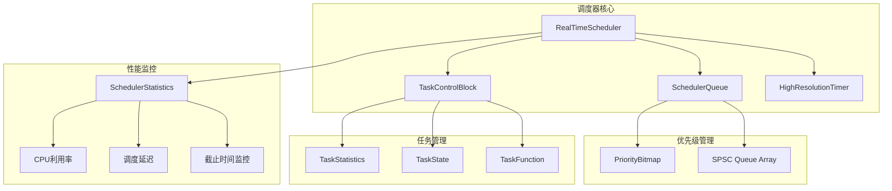

# 调度器模块 (Scheduler)

**路径**: `src/scheduler/`  
**导航**: [🏠 项目根目录](/root/Repos/plcopen/CLAUDE.md) > 调度器模块  
**模块类型**: 核心运行时模块  
**开发状态**: 🟡 MVP-1 开发中

## 📋 模块概述

实时调度器是PLC运行时系统的核心组件，负责微秒级精度的确定性任务调度。基于无锁架构设计，支持抢占式调度和256级优先级管理。

### 核心特性
- **微秒精度**: 调度抖动 < 50μs，调度周期可配置
- **高优先级**: 支持256级优先级，O(1)时间复杂度查找
- **无锁架构**: 避免优先级反转，确保实时性
- **性能监控**: 详细的执行统计和性能分析
- **容错机制**: 异常处理和错误恢复

## 🏗️ 架构设计



## 📁 文件结构

### 核心文件
- **[RealTimeScheduler.h](/root/Repos/plcopen/src/scheduler/RealTimeScheduler.h)** - 主调度器接口定义
- **[RealTimeScheduler.cpp](/root/Repos/plcopen/src/scheduler/RealTimeScheduler.cpp)** - 调度器基础实现
- **[RealTimeSchedulerOptimized.cpp](/root/Repos/plcopen/src/scheduler/RealTimeSchedulerOptimized.cpp)** - 优化版实现
- **[RealTimeSchedulerImpl.cpp](/root/Repos/plcopen/src/scheduler/RealTimeSchedulerImpl.cpp)** - 具体实现

### 任务管理
- **[TaskControlBlock.h](/root/Repos/plcopen/src/scheduler/TaskControlBlock.h)** - 增强版任务控制块
- **[TaskControlBlock.cpp](/root/Repos/plcopen/src/scheduler/TaskControlBlock.cpp)** - TCB实现
- **[TaskControlBlock_minimal.h](/root/Repos/plcopen/src/scheduler/TaskControlBlock_minimal.h)** - 最小化TCB
- **[TaskControlBlock_simple.h](/root/Repos/plcopen/src/scheduler/TaskControlBlock_simple.h)** - 简化版TCB
- **[Task.h](/root/Repos/plcopen/src/scheduler/Task.h)** - 任务抽象接口
- **[Task.cpp](/root/Repos/plcopen/src/scheduler/Task.cpp)** - 任务实现

### 调度队列
- **[SchedulerQueue.h](/root/Repos/plcopen/src/scheduler/SchedulerQueue.h)** - 高性能调度队列
- **[SchedulerQueue.cpp](/root/Repos/plcopen/src/scheduler/SchedulerQueue.cpp)** - 队列实现

### 无锁数据结构
- **[lockfree/spsc_queue.h](/root/Repos/plcopen/src/scheduler/lockfree/spsc_queue.h)** - 单生产者单消费者队列

### 示例和基准测试
- **[example_scheduler.cpp](/root/Repos/plcopen/src/scheduler/example_scheduler.cpp)** - 调度器使用示例
- **[benchmark_scheduler.cpp](/root/Repos/plcopen/src/scheduler/benchmark_scheduler.cpp)** - 性能基准测试

## 🔧 核心接口

### 调度器配置
```cpp
struct SchedulerConfig {
    uint64_t tick_period_ns = 1000000;        // 1ms调度周期
    uint64_t max_jitter_ns = 50000;           // 最大抖动50μs
    uint32_t max_tasks = 1024;                // 最大任务数
    bool enable_statistics = true;            // 启用统计
    bool enable_deadline_monitoring = true;   // 启用截止时间监控
    int scheduler_cpu_affinity = -1;          // CPU亲和性
    int scheduler_priority = 99;              // 调度器优先级
};
```

### 任务控制块
```cpp
struct TaskControlBlock {
    uint32_t task_id;                    // 任务ID
    TaskState state;                     // 任务状态
    TaskType type;                       // 任务类型
    Priority priority;                   // 优先级(0-255)
    uint64_t period_ns;                  // 任务周期
    uint64_t deadline_ns;                // 截止时间
    uint64_t wcet_ns;                    // 最坏执行时间
    TaskFunction entry_point;            // 入口函数
    
    // 执行统计
    std::atomic<uint64_t> exec_count;        // 执行次数
    std::atomic<uint64_t> total_exec_time_ns; // 总执行时间
    std::atomic<uint64_t> max_exec_time_ns;   // 最大执行时间
    std::atomic<uint64_t> deadline_miss_count; // 截止时间错失
};
```

### 主要方法
```cpp
class RealTimeScheduler {
public:
    // 调度器生命周期
    bool initialize(const SchedulerConfig& config);
    bool start();
    bool stop();
    void shutdown();
    
    // 任务管理
    uint32_t create_task(const std::string& name, TaskType type, 
                        Priority priority, uint64_t period_ns = 0);
    bool destroy_task(uint32_t task_id);
    bool set_task_function(uint32_t task_id, TaskFunction function);
    bool activate_task(uint32_t task_id);
    bool deactivate_task(uint32_t task_id);
    
    // 状态查询
    TaskState get_task_state(uint32_t task_id) const;
    SchedulerStatistics get_statistics() const;
    bool is_running() const;
    
    // 性能监控
    double get_cpu_utilization() const;
    double get_average_scheduling_latency_ns() const;
    uint64_t get_deadline_miss_count() const;
};
```

## 📊 性能特征

### 时间指标
| 指标 | 目标值 | 测试条件 |
|------|--------|----------|
| 调度延迟 | < 50μs | 256个活跃任务 |
| 任务切换 | < 5μs | 相同优先级任务 |
| 优先级查找 | O(1) | 位图算法 |
| 队列操作 | < 1μs | 无锁SPSC队列 |

### 内存使用
| 组件 | 内存占用 | 说明 |
|------|----------|------|
| TCB | 256 bytes | 缓存行对齐 |
| 调度队列 | 8KB | 256级优先级 |
| 位图 | 32 bytes | 256位优先级位图 |
| 统计数据 | 512 bytes | 性能计数器 |

## 🔍 关键算法

### 优先级调度算法
```cpp
Priority find_highest_priority() const {
    for (size_t word_idx = 0; word_idx < NUM_WORDS; ++word_idx) {
        uint64_t word = bitmap_[word_idx].load(std::memory_order_relaxed);
        if (word != 0) {
            int bit_pos = __builtin_ctzll(word);  // 查找最低位
            return static_cast<Priority>(word_idx * 64 + bit_pos);
        }
    }
    return MAX_PRIORITIES;  // 没有就绪任务
}
```

### 无锁队列入队
```cpp
bool enqueue(TCBPtr tcb) {
    Priority priority = tcb->priority;
    auto& queue = priority_queues_[priority];
    
    bool success = queue.ready_queue.push(tcb.get());
    if (success) {
        bitmap_.set_priority(priority);
        task_count_.fetch_add(1, std::memory_order_relaxed);
    }
    
    return success;
}
```

### 调度决策
```cpp
void schedule_next_task() {
    Priority highest = queue_.find_highest_priority();
    if (highest != Priority::INVALID) {
        TCBPtr next_task = queue_.dequeue_from_priority(highest);
        if (next_task) {
            context_switch_to(next_task);
        }
    }
}
```

## 🧪 测试覆盖

### 单元测试
- ✅ 任务创建和销毁
- ✅ 优先级调度正确性
- ✅ 无锁队列操作
- ✅ 统计数据准确性
- 🟡 异常处理机制

### 集成测试
- ✅ 多任务并发调度
- ✅ 截止时间监控
- 🟡 CPU亲和性设置
- 🟡 实时性能验证

### 性能测试
- ✅ 调度延迟基准测试
- ✅ CPU利用率测试
- 🟡 长期稳定性测试
- ⏳ 压力测试

## 🚀 使用示例

### 基本调度器创建
```cpp
#include "scheduler/RealTimeScheduler.h"

// 配置调度器
SchedulerConfig config;
config.tick_period_ns = 1000000;  // 1ms
config.max_tasks = 64;
config.scheduler_priority = 99;

// 创建调度器
auto scheduler = std::make_unique<RealTimeScheduler>();
scheduler->initialize(config);

// 创建任务
uint32_t task_id = scheduler->create_task(
    "control_task",           // 任务名称
    TaskType::CYCLIC,        // 周期任务
    10,                      // 优先级
    1000000                  // 1ms周期
);

// 设置任务函数
scheduler->set_task_function(task_id, []() {
    // 控制逻辑
    std::cout << "执行控制任务\n";
});

// 启动调度器
scheduler->start();
```

### 性能监控
```cpp
// 获取统计信息
auto stats = scheduler->get_statistics();

std::cout << "CPU利用率: " << stats.get_cpu_utilization() * 100 << "%\n";
std::cout << "平均调度延迟: " << stats.get_average_scheduling_time_ns() << "ns\n";
std::cout << "截止时间错失: " << stats.deadline_misses.load() << "\n";
std::cout << "最大抖动: " << stats.max_jitter_ns.load() << "ns\n";
```

## 🔧 配置选项

### 编译时配置
```cpp
// 最大任务数量
#define MAX_TASKS 1024

// 最大优先级级别
#define MAX_PRIORITY_LEVELS 256

// 启用调试统计
#define ENABLE_SCHEDULER_STATISTICS 1

// 启用性能分析
#define ENABLE_PERFORMANCE_PROFILING 1
```

### 运行时配置
```cpp
// 动态调整调度周期
scheduler->set_tick_period_ns(500000);  // 0.5ms

// 设置CPU亲和性
scheduler->set_cpu_affinity(2);  // 绑定到CPU核心2

// 启用/禁用截止时间监控
scheduler->enable_deadline_monitoring(true);
```

## 🐛 故障排除

### 常见问题
1. **调度延迟过高**
   - 检查系统负载和CPU亲和性
   - 验证RT-PREEMPT内核配置
   - 调整调度器优先级

2. **截止时间错失**
   - 检查任务WCET配置
   - 验证系统时间同步
   - 分析任务执行时间分布

3. **内存使用异常**
   - 检查TCB泄漏
   - 验证队列大小配置
   - 监控统计数据结构

### 调试工具
```cpp
// 启用详细调试日志
scheduler->enable_debug_logging(true);

// 导出性能报告
auto report = scheduler->generate_performance_report();
report.export_to_file("scheduler_perf.json");

// 实时监控
scheduler->start_real_time_monitoring();
```

## 🔮 未来计划

### 短期目标 (MVP-1)
- ✅ 基础调度器实现
- 🟡 性能优化和调试
- ⏳ 完整单元测试覆盖
- ⏳ 与I/O系统集成

### 中期目标
- 分布式调度支持
- GPU任务调度
- 能耗管理
- 自适应调度算法

### 长期目标
- 机器学习优化调度
- 云原生调度器
- 混合关键性调度
- 量子计算任务调度

---

*本文档反映调度器模块的当前实现状态和设计决策。*