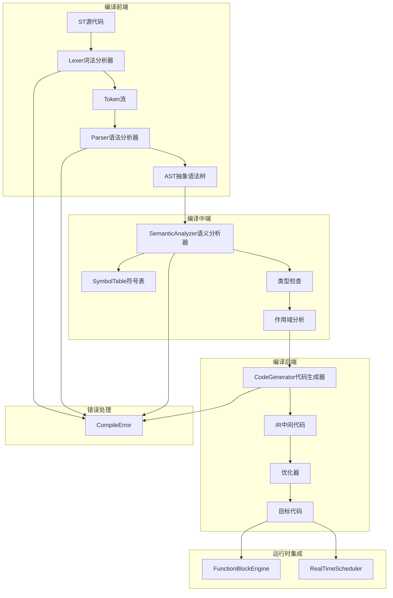

# ST编译器模块 (ST Compiler)

**路径**: `src/st_compiler/` 和 `include/st_compiler/`  
**导航**: [🏠 项目根目录](/root/Repos/plcopen/CLAUDE.md) > ST编译器模块  
**模块类型**: 应用层编程语言支持  
**开发状态**: 🟡 MVP-1 开发中

## 📋 模块概述

ST编译器模块负责IEC 61131-3标准的结构化文本(Structured Text)语言的解析、编译和代码生成。支持完整的ST语法子集，包括变量声明、控制流语句、表达式计算和功能块调用，生成高效的中间代码用于运行时执行。

### 核心特性
- **标准兼容**: 严格遵循IEC 61131-3 ST语言规范
- **高性能编译**: 编译时间 < 1s (1000行代码)
- **丰富类型**: 支持基本类型、数组、结构体
- **错误诊断**: 详细的编译错误定位和提示
- **代码优化**: 生成优化的中间代码

## 🏗️ 架构设计



## 📁 文件结构

### 头文件 (include/st_compiler/)
- **[STCompiler.h](/root/Repos/plcopen/include/st_compiler/STCompiler.h)** - 主编译器接口
- **[AST.h](/root/Repos/plcopen/include/st_compiler/AST.h)** - 抽象语法树定义
- **[Lexer.h](/root/Repos/plcopen/include/st_compiler/Lexer.h)** - 词法分析器接口
- **[SymbolTable.h](/root/Repos/plcopen/include/st_compiler/SymbolTable.h)** - 符号表管理

### 实现文件 (src/st_compiler/)
- **[STCompiler.cpp](/root/Repos/plcopen/src/st_compiler/STCompiler.cpp)** - 编译器主实现
- **[Lexer.cpp](/root/Repos/plcopen/src/st_compiler/Lexer.cpp)** - 词法分析器实现
- **[Parser.cpp](/root/Repos/plcopen/src/st_compiler/Parser.cpp)** - 语法分析器实现
- **[SemanticAnalyzer.cpp](/root/Repos/plcopen/src/st_compiler/SemanticAnalyzer.cpp)** - 语义分析实现
- **[CodeGenerator.cpp](/root/Repos/plcopen/src/st_compiler/CodeGenerator.cpp)** - 代码生成器实现

### 测试文件
- **[test_st_compiler.cpp](/root/Repos/plcopen/test_st_compiler.cpp)** - ST编译器单元测试

## 🔧 核心接口

### 编译器主接口
```cpp
class STCompiler {
public:
    struct CompileOptions {
        bool optimize = true;           // 启用优化
        bool debug_info = false;        // 生成调试信息
        bool strict_mode = true;        // 严格模式
        size_t max_errors = 10;         // 最大错误数
    };
    
    // 编译流程
    bool compile_file(const std::string& filepath, const CompileOptions& options = {});
    bool compile_string(const std::string& source, const CompileOptions& options = {});
    
    // 结果获取
    std::shared_ptr<CompiledProgram> get_compiled_program() const;
    const std::vector<CompileError>& get_errors() const;
    const std::vector<CompileWarning>& get_warnings() const;
    
    // 统计信息
    CompileStatistics get_statistics() const;
    std::chrono::milliseconds get_compile_time() const;
};
```

### 数据类型系统
```cpp
enum class STDataType : uint8_t {
    BOOL = 1,       // 布尔类型
    SINT = 2,       // 短整型 (-128..127)
    INT = 3,        // 整型 (-32768..32767)
    DINT = 4,       // 双整型 (-2^31..2^31-1)
    LINT = 5,       // 长整型 (-2^63..2^63-1)
    USINT = 6,      // 无符号短整型 (0..255)
    UINT = 7,       // 无符号整型 (0..65535)
    UDINT = 8,      // 无符号双整型 (0..2^32-1)
    ULINT = 9,      // 无符号长整型 (0..2^64-1)
    REAL = 10,      // 实数类型 (32位浮点)
    LREAL = 11,     // 长实数类型 (64位浮点)
    STRING = 12,    // 字符串类型
    TIME = 13,      // 时间类型
    DATE = 14,      // 日期类型
    TOD = 15,       // 时刻类型
    DT = 16,        // 日期时间类型
    ARRAY = 17,     // 数组类型
    STRUCT = 18     // 结构体类型
};
```

### 抽象语法树节点
```cpp
class ASTNode {
public:
    explicit ASTNode(ASTNodeType type, size_t line = 0, size_t column = 0);
    virtual ~ASTNode() = default;
    
    ASTNodeType get_type() const { return type_; }
    size_t get_line() const { return line_; }
    size_t get_column() const { return column_; }
    
    // 子节点管理
    void add_child(std::unique_ptr<ASTNode> child);
    const std::vector<std::unique_ptr<ASTNode>>& get_children() const;
    
    // 访问器模式支持
    virtual void accept(ASTVisitor& visitor) = 0;
};
```

### 符号表管理
```cpp
class SymbolTable {
public:
    struct Symbol {
        std::string name;           // 符号名称
        STDataType type;            // 数据类型
        StorageClass storage_class; // 存储类别
        size_t offset;              // 内存偏移
        bool is_initialized;        // 是否已初始化
        std::any default_value;     // 默认值
    };
    
    // 作用域管理
    void push_scope(const std::string& name);
    void pop_scope();
    
    // 符号操作
    bool declare_symbol(const Symbol& symbol);
    Symbol* lookup_symbol(const std::string& name);
    bool is_symbol_defined(const std::string& name) const;
    
    // 类型检查
    bool is_type_compatible(STDataType from, STDataType to) const;
    STDataType get_promotion_type(STDataType left, STDataType right) const;
};
```

## 📊 支持的语法特性

### 变量声明
```st
VAR
    counter : INT := 0;                    // 带初值的整型变量
    flag : BOOL := FALSE;                  // 布尔变量
    temperature : REAL;                    // 实数变量
    message : STRING(50) := 'Hello';       // 字符串变量
    values : ARRAY[1..10] OF INT;          // 整型数组
END_VAR
```

### 控制流语句
```st
// IF语句
IF temperature > 100.0 THEN
    alarm := TRUE;
    message := 'Overheating';
ELSIF temperature < 0.0 THEN
    alarm := TRUE;
    message := 'Too cold';
ELSE
    alarm := FALSE;
    message := 'Normal';
END_IF;

// FOR循环
FOR i := 1 TO 10 BY 1 DO
    sum := sum + values[i];
END_FOR;

// WHILE循环
WHILE counter < 100 DO
    counter := counter + 1;
    process_data(counter);
END_WHILE;

// CASE语句
CASE mode OF
    1: output := input1;
    2: output := input2;
    3: output := input1 + input2;
    ELSE
        output := 0;
END_CASE;
```

### 表达式和运算符
```st
// 算术运算
result := a + b * c - d / e;

// 比较运算
is_equal := (value1 = value2);
is_greater := (temp > limit);

// 逻辑运算
condition := flag1 AND flag2 OR NOT flag3;

// 函数调用
sine_value := SIN(angle);
string_length := LEN(message);
```

### 功能块调用
```st
// 定时器功能块
timer1(IN := start_signal, PT := T#5s);
output_enable := timer1.Q;
elapsed_time := timer1.ET;

// 计数器功能块
counter1(CU := count_pulse, R := reset_signal, PV := 100);
count_done := counter1.Q;
current_count := counter1.CV;
```

## 🧪 编译流程

### 词法分析阶段
```cpp
class Lexer {
public:
    enum class TokenType {
        // 关键字
        VAR, END_VAR, IF, THEN, ELSE, END_IF,
        FOR, TO, BY, DO, END_FOR,
        WHILE, END_WHILE,
        CASE, OF, END_CASE,
        
        // 操作符
        ASSIGN, EQ, NE, LT, LE, GT, GE,
        PLUS, MINUS, MULTIPLY, DIVIDE,
        AND, OR, NOT,
        
        // 字面量
        IDENTIFIER, INT_LITERAL, REAL_LITERAL, 
        STRING_LITERAL, BOOL_LITERAL,
        
        // 分隔符
        SEMICOLON, COLON, COMMA,
        LPAREN, RPAREN, LBRACKET, RBRACKET
    };
    
    struct Token {
        TokenType type;
        std::string lexeme;
        size_t line;
        size_t column;
        std::any value;  // 字面量值
    };
    
    std::vector<Token> tokenize(const std::string& source);
};
```

### 语法分析阶段
```cpp
class Parser {
public:
    // 递归下降解析器
    std::unique_ptr<ASTNode> parse_program();
    std::unique_ptr<ASTNode> parse_variable_declarations();
    std::unique_ptr<ASTNode> parse_statement_list();
    std::unique_ptr<ASTNode> parse_statement();
    std::unique_ptr<ASTNode> parse_expression();
    
private:
    // 语法规则实现
    std::unique_ptr<ASTNode> parse_if_statement();
    std::unique_ptr<ASTNode> parse_for_statement();
    std::unique_ptr<ASTNode> parse_while_statement();
    std::unique_ptr<ASTNode> parse_assignment();
    std::unique_ptr<ASTNode> parse_binary_expression(int precedence);
};
```

### 语义分析阶段
```cpp
class SemanticAnalyzer {
public:
    // 语义检查
    bool analyze(ASTNode* ast_root);
    
    // 类型检查
    STDataType check_expression_type(ASTNode* expr);
    bool check_assignment_compatibility(ASTNode* lhs, ASTNode* rhs);
    
    // 作用域检查
    bool check_variable_declarations();
    bool check_variable_references();
    
    // 函数块调用检查
    bool check_function_block_call(ASTNode* call_node);
};
```

### 代码生成阶段
```cpp
class CodeGenerator {
public:
    struct Instruction {
        enum OpCode {
            LOAD_VAR, STORE_VAR, LOAD_CONST,
            ADD, SUB, MUL, DIV, MOD,
            EQ, NE, LT, LE, GT, GE,
            AND, OR, NOT,
            JUMP, JUMP_IF_FALSE,
            CALL_FB, RETURN,
            HALT
        };
        
        OpCode opcode;
        union {
            uint32_t operand;
            float real_operand;
        };
    };
    
    std::vector<Instruction> generate_code(ASTNode* ast_root);
    
private:
    void visit_assignment(ASTNode* node);
    void visit_if_statement(ASTNode* node);
    void visit_for_loop(ASTNode* node);
    void visit_expression(ASTNode* node);
};
```

## 🚀 使用示例

### 基本编译流程
```cpp
#include "st_compiler/STCompiler.h"

// 创建编译器
STCompiler compiler;

// 设置编译选项
STCompiler::CompileOptions options;
options.optimize = true;
options.debug_info = false;
options.strict_mode = true;

// ST源代码
std::string st_code = R"(
    PROGRAM Main
    VAR
        counter : INT := 0;
        timer : TON;
        output : BOOL := FALSE;
    END_VAR
    
    timer(IN := TRUE, PT := T#1s);
    IF timer.Q THEN
        counter := counter + 1;
        output := (counter > 10);
        timer(IN := FALSE);
    END_IF;
    END_PROGRAM
)";

// 编译源代码
if (compiler.compile_string(st_code, options)) {
    auto program = compiler.get_compiled_program();
    std::cout << "编译成功！\n";
    
    // 获取编译统计
    auto stats = compiler.get_statistics();
    std::cout << "编译时间: " << compiler.get_compile_time().count() << "ms\n";
    std::cout << "生成指令数: " << stats.instruction_count << "\n";
} else {
    // 处理编译错误
    for (const auto& error : compiler.get_errors()) {
        std::cout << "错误 [" << error.line << ":" << error.column << "] " 
                  << error.message << "\n";
    }
}
```

### 自定义功能块集成
```cpp
// 注册自定义功能块
compiler.register_function_block("MY_TIMER", {
    {"IN", STDataType::BOOL, StorageClass::VAR_INPUT},
    {"PT", STDataType::TIME, StorageClass::VAR_INPUT},
    {"Q", STDataType::BOOL, StorageClass::VAR_OUTPUT},
    {"ET", STDataType::TIME, StorageClass::VAR_OUTPUT}
});

// ST代码中使用
std::string st_code = R"(
    PROGRAM Test
    VAR
        my_timer : MY_TIMER;
        start : BOOL := TRUE;
        done : BOOL;
    END_VAR
    
    my_timer(IN := start, PT := T#2s);
    done := my_timer.Q;
    END_PROGRAM
)";
```

### 运行时集成
```cpp
// 编译成功后集成到运行时
if (compiler.compile_string(st_code)) {
    auto compiled_program = compiler.get_compiled_program();
    
    // 注册到功能块引擎
    auto fb_engine = runtime->getFunctionBlockEngine();
    fb_engine->load_program(compiled_program);
    
    // 在调度器中执行
    auto scheduler = runtime->getScheduler();
    uint32_t task_id = scheduler->create_task("ST_Program", TaskType::CYCLIC, 10, 10000000); // 10ms
    scheduler->set_task_function(task_id, [compiled_program]() {
        compiled_program->execute();
    });
}
```

## 🧪 测试覆盖

### 单元测试
- ✅ 词法分析器测试
- ✅ 语法分析器测试
- ✅ 语义分析器测试
- 🟡 代码生成器测试
- 🟡 错误处理测试

### 集成测试
- ✅ 完整编译流程
- 🟡 功能块集成
- 🟡 运行时集成
- ⏳ 性能基准测试

### 语言特性测试
- ✅ 变量声明和初始化
- ✅ 基本控制流语句
- ✅ 表达式计算
- 🟡 数组和结构体
- ⏳ 复杂嵌套结构

## 🔧 配置选项

### 编译时配置
```cpp
// 最大符号表大小
#define MAX_SYMBOLS 4096

// 最大AST节点数
#define MAX_AST_NODES 8192

// 启用编译器调试
#define ENABLE_COMPILER_DEBUG 1

// 优化级别
#define OPTIMIZATION_LEVEL 2
```

### 语言支持级别
```cpp
enum class LanguageLevel {
    BASIC,      // 基础ST语法
    STANDARD,   // 标准IEC 61131-3
    EXTENDED    // 扩展特性
};
```

## 🐛 故障排除

### 常见编译错误
1. **语法错误**
   ```
   错误 [12:15] 期望 ';' 但得到 'END_IF'
   ```

2. **类型不匹配**
   ```
   错误 [8:12] 无法将 'REAL' 赋值给 'INT' 类型变量
   ```

3. **未定义变量**
   ```
   错误 [15:8] 变量 'unknown_var' 未声明
   ```

### 调试工具
```cpp
// 启用详细编译日志
compiler.set_verbose_mode(true);

// 导出AST到文件
compiler.export_ast("program.ast");

// 导出符号表
compiler.export_symbol_table("symbols.txt");

// 导出中间代码
compiler.export_intermediate_code("program.ir");
```

## 🔮 未来计划

### 短期目标 (MVP-1)
- ✅ 基础ST语法支持
- 🟡 完整错误诊断
- ⏳ 代码优化实现
- ⏳ 运行时集成完成

### 中期目标
- 完整IEC 61131-3支持
- 结构化数据类型
- 用户定义功能块
- 代码调试支持

### 长期目标
- IL指令表语言支持
- 图形化编程语言
- 交互式调试器
- 智能代码补全

---

*本文档反映ST编译器模块的当前实现状态和语言支持水平。*